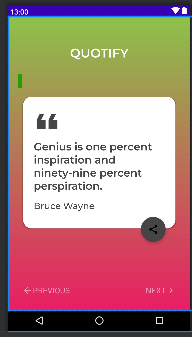

    
    <h1 align="center">Quotes</h1>

&nbsp;&nbsp;&nbsp;&nbsp;&nbsp;&nbsp;&nbsp;&nbsp;

## 🌟 About
A Quote app for motivating you throught your hustle.
So, Basically, Quote is very basic app using
- Android Kotlin
- Backend Development
- MVVM (Model View ViewModel) Architecture
- Explicit Intents

&nbsp;&nbsp;&nbsp;&nbsp;&nbsp;&nbsp;&nbsp;&nbsp;

## Connect with me

<a href="https://www.linkedin.com/in/uphargaur" target="_blank">

 
    
